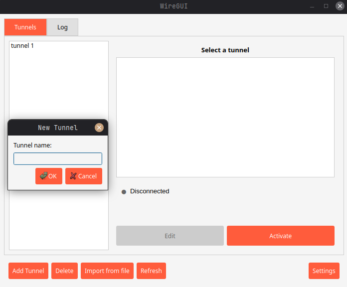
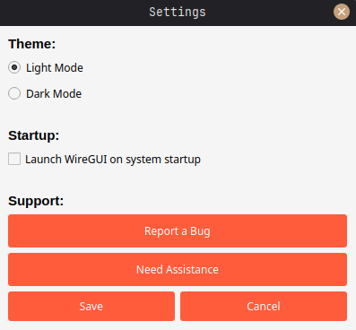

# WireGUI

WireGUI is a lightweight graphical interface for managing WireGuard tunnels on Linux.  
It provides a simple desktop application to enable and disable WireGuard interfaces without using the command line.

The application uses PolicyKit (`pkexec`) to securely perform privileged operations when required.

---

## Features

- Simple GUI for managing WireGuard tunnels
- Enable and disable tunnels with a single click
- Reads and writes configuration files in `/etc/wireguard`
- Secure privilege escalation using PolicyKit (`pkexec`)
- Distributed as a Debian (`.deb`) package

---

## IMAGES





## Supported platforms

- Ubuntu
- Linux Mint
- Debian-based Linux distributions

> Designed for desktop Linux systems.  
> X11 is recommended; Wayland support may vary depending on the desktop environment.

---

## Installation

Download the latest `.deb` file from the **GitHub Releases** page and install it using:

```bash
sudo apt install ./wiregui_1.0.0_all.deb
```
After installation, WireGUI will be available in your application menu.

## Usage

1. Launch WireGUI from the application menu
2. Authenticate when prompted (PolicyKit password dialog)
3. Select a WireGuard tunnel configuration
4. Enable or disable the tunnel using the GUI
5. WireGUI manages tunnels using wg-quick up and wg-quick down.

## How It Works

- WireGUI runs as a normal user application
- When a privileged action is required, authorization is requested via PolicyKit
- No persistent root process is used
- No network services are exposed

## Requirements

The following dependencies are required and are automatically installed by the .deb package:
wireguard-tools
policykit-1
python3
python3-pyqt5

## Security Model

- WireGUI does not run continuously as root
- Administrative privileges are requested only when required
- Privilege escalation is handled through PolicyKit
- No credentials or sensitive data are stored
